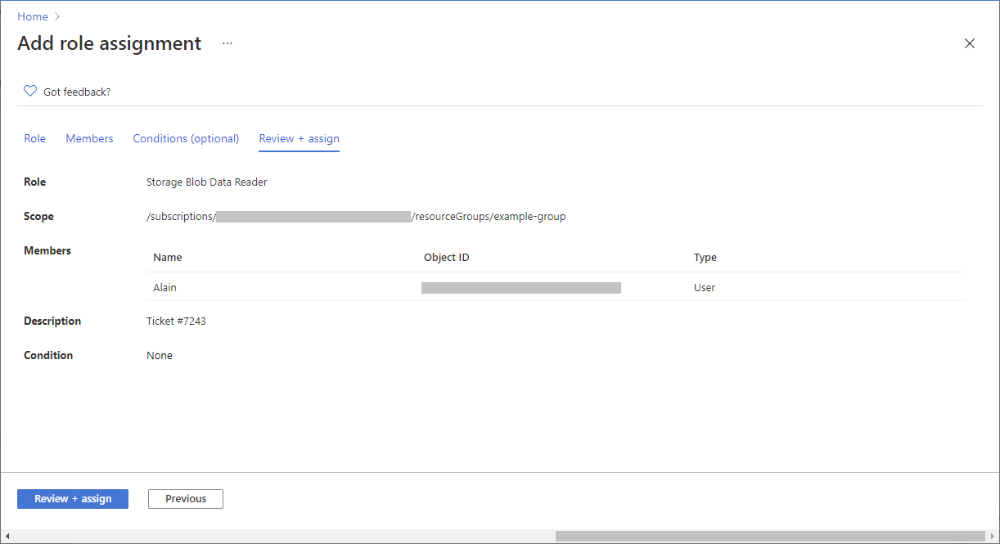

# Step 1: Open the subscription
Follow these steps:
1. Sign in to the Azure portal.
2. In the Search box at the top, search for subscriptions.
3. Click the subscription you want to use.
   The following shows an example subscription.

# Step 2: Open the Add role assignment page
Access control (IAM) is the page that you typically use to assign roles to grant access to Azure resources. It's also known as identity and access management (IAM) and appears in several locations in the Azure portal.
1. Click Access control (IAM).
   The following shows an example of the Access control (IAM) page for a subscription.

2. Click the Role assignments tab to view the role assignments at this scope.
3. Click Add > Add role assignment. 
If you don't have permissions to assign roles, the Add role assignment option will be disabled.

The Add role assignment page opens.
# Step 3: Select the Owner role
The Owner role grant full access to manage all resources, including the ability to assign roles in Azure RBAC. You should have a maximum of 3 subscription owners to reduce the potential for breach by a compromised owner.
1. On the Role tab, select the Reader roles tab.

2. Select the Reader role.
3. Click Next.
4. Click Next.
# Step 4: Select who needs access
1. To select who needs access, follow these steps:
On the Members tab, select User, group, or service principal to assign the selected role to one or more Microsoft Entra users, groups, or service principals (applications).

2. Click Select members.
3. Find and select the users, groups, or service principals.
You can type in the Select box to search the directory for display name or email address.

4. Click Select to add the user to the Members list.
5. Click Select members.
# Step 5: Assign role
Follow these steps:
1. On the Review + assign tab, review the role assignment settings.

2. Click Review + assign to assign the role.